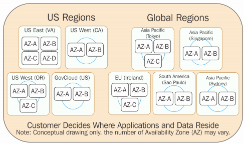
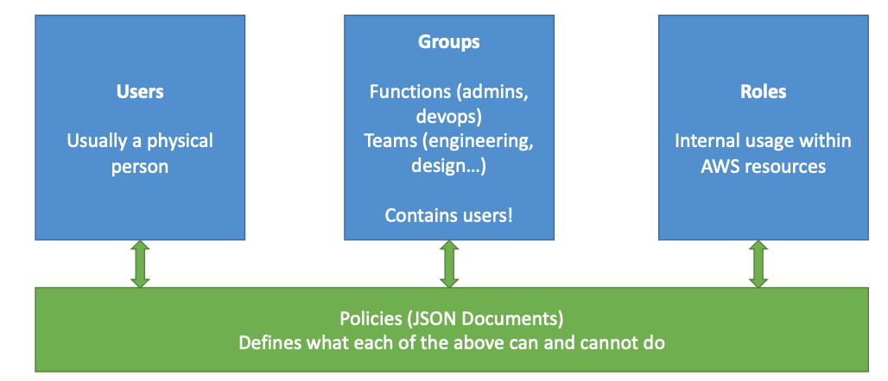
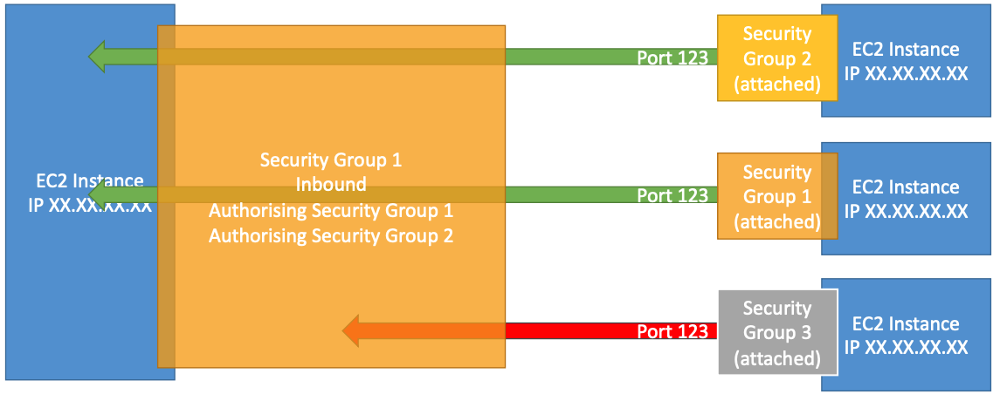

# AWS Services Fundamentals

* Developing
	* __Regions__
	* __IAM__
	* __EC2 & Security Groups__
	* ELB
	* __Route 53__
	* __RDS__
	* __ElastiCache__
	* __VPC__
	* __S3__
	* __CloudFront__
* Deploying
	* __Elastic Beanstalk__
	* ECS
	* CI/CD
		* CodeCommit
		* CodePipeline
		* CodeBuild
		* CodeDeploy
	* Infrastructure as a code
		* CloudFormation
	* Monitoring, Troubleshooting & Audit
		* Cloudwatch
		* X-Ray
		* CloudTrail

## Regions

Each region has __availability zones__ which are a physical data center in the region.

__All services are region scoped except__:

* IAM
* S3
* Route53

## IAM

* Identity and Access Management
* Whole AWS security is here
* IAM has a GLOBAL view
* MFA (Multi Factor Authentication) can be setup
* Least privilege principles

### Best Practices

Only 1 IAM User per PHYISICAL PERSON
Only 1 IAM Role per Application
IAM Credentials should never be shared
IAM Credentials should never be written in code
Root credentials should only be used for initial setup

## EC2

### Must know

* How to SSH and troubleshoot .pem file permissions.
* How to properly use Security Groups.
* Fundamentals differences between Private and Public IP.
	* By default comes with Private IP for internal AWS network and Public IP that may change on restarts.
	* Elastic IP to use a fixed public IP
* How to use User Data to customize your instance at boot time.
* Build custom AMI to enchance your OS.

### Security Groups
EC2 instance billed by the second and can be easily thrown away.

### Security Groups

* Can be attached to multiple instances.
* Locked down to region / VPC.
* Lives “outside” EC2 - instance won’t see blocked traffic.
* It’s good to maintain one separate security group for SSH.
* Application not accessible (timeout) means security group issue.
* Application “connection refused” means application error or not launched.
* All inbound traffic is blocked by default.
* All outbound traffic is authorized by default.
* Can reference to other security groups.

## [Route 53](https://github.com/herrera-ignacio/aws_certification/tree/master/fundamentals/Route53)

Route53 is a Managed DNS, a collection of rules and records which helps clients understand how to reach a server through URLs.

* Load Balancing (through DNS: client load balancing)
* Health Checks
* Routing Policy
	* Simple
	* Failover
	* Geolocation
	* Geoproximity
	* Latency
	* Weighted

## [RDS](https://github.com/herrera-ignacio/aws_certification/tree/master/fundamentals/RDS)

It allows you to create databases in the cloud that are managed by AWS:

* Postgres
* Oracle
* MySQL
* MariaDB
* Microsft SQL Server
* Aurora (AWS Proprietary database)

### Must know

* RDS vs Deploying DB on EC2
* Read Replicas
* Disaster Recovery
* Backups
* Snapshots
* Encryption
	* At Rest
	* In Flight
* Security
	* Private subnets
	* Security groups
	* IAM policies
	* Traditional auth and IAM users for particular cases
* RDS Aurora (cloud optimized)

Managed service:

* OS Patching level
* Continuous backups and restore to specific timestamp (Point in Time Restore)
* Monitoring dashboards
* Read replicas for improved read performance
* Multi AZ setup for DR (Disaster Recovery)
* Maintenance windows for upgrades
* Scaling capability (Vertical and Horizontal)

## [VPC](https://github.com/herrera-ignacio/aws_certification/tree/master/fundamentals/VPC)

* VPC is a private network to deploy your regional resources.
* Subnets allow you to partition your network inside your VPC.
* Public Subnet is a subnet that is accessible from the internet.
* Private Subnet is a subnet that is not accessibel from te internet.

## [S3](https://github.com/herrera-ignacio/aws_certification/tree/master/fundamentals/S3)

* Overview
* Versioning
* Encryption
* Security
	* User based
	* Resource based
* Policies
* Other Security Concerns
	* Networking
	* Logging and Audit
	* User Security
* Static websites
* [CORS](https://github.com/herrera-ignacio/aws_certification/tree/master/fundamentals/S3#s3-cors)
* [Consistency Model](https://github.com/herrera-ignacio/aws_certification/tree/master/fundamentals/S3#consistency-model)
* Performance
	* CloudFront to cache around the world
	* Encrytption limits
	* multipart upload
* Storage Classes
	* Standard - General Purpose
	* Standard-Infrequent Access (IA)
	* One Zone-Infrequent Access
	* Intelligent Tiering
	* Glacier
	* Glacier Deep Archive
* S3 & Glacier Select
* Transition between storage classes
* Replication
* Pre-Signed URLS
* Event Notifications
* S3 Object Lock & Glacier Vault Lock

### Must know

* Buckets must have a globally unique name.
* Buckets are defined at the region level.
* Naming conventions
	* No uppercase
	* No underscore
	* 3-63 characters long
	* Not an IP
* Objects (files) have as key the full path.
* There's no concept of 'directories' within buckets altough UI will trick you to think otherwise.
* Versioning
	* Rollback
	* Can enable at any moment
* Encryption

## [CloudFront](https://github.com/herrera-ignacio/aws_certification/tree/master/fundamentals/CloudFront)

Content Delivery Network (CDN) that improved read performance by caching at multiple edge locations (216 Point of Presence Globaly.)

It comes with DDoS Protection, integration with Shield AWS Web Application Firewall.

Can expose external HTTPS and talk to internal HTTP backends.

* Origins
	* S3
	* ALB/EC2 (Custom backend)
* Geo Restriction
* CloudFront vs S3 Cross Origin Replication
* Caching
* Signed URL / Signed Cookies
* CloudFront Signed URL vs S3 Pre-Signed URL

## CloudWatch

CloudWatch provides you with data and actionable insights to monitor your applications, respond to system-wide performance changes, optimize resource utilization, and get a unified view of operational health. CloudWatch collects monitoring and operational data in the form of logs, metrics, and events, providing you with a unified view of AWS resources, applications, and services that run on AWS and on-premises servers.
