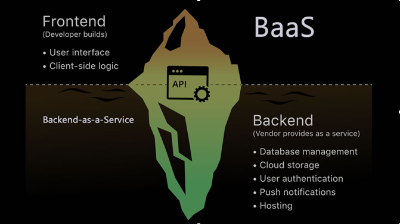
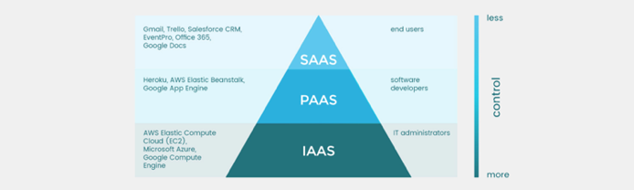

# Intro to Cloud

Cloud computing is the on-demand availability of computer system resources, especially data storage and computing power, without direct active management by the user.

## Categories

## Why

### Product PoV

* Availability & Disaster Recovery
* Scalability

### Business PoV

* Resource optimization (No more idle resources)
* Cost predictability
* Focus on business logic
* Have the best talent doing what they know the most

## New challenges

* New kind of Operations Experts
	* Infrastructure as a Code
	* Virtualization & Containers
	* AWS/GCP/Azure Solutions Architect/DevOps/Security
* Focus on harder problems
	* DevOps, CI/CD, version control of infrastructure, automatically provisioning environments, etc
	* Business and costs trade-offs, optimizing resources, etc (more options to choose from)
